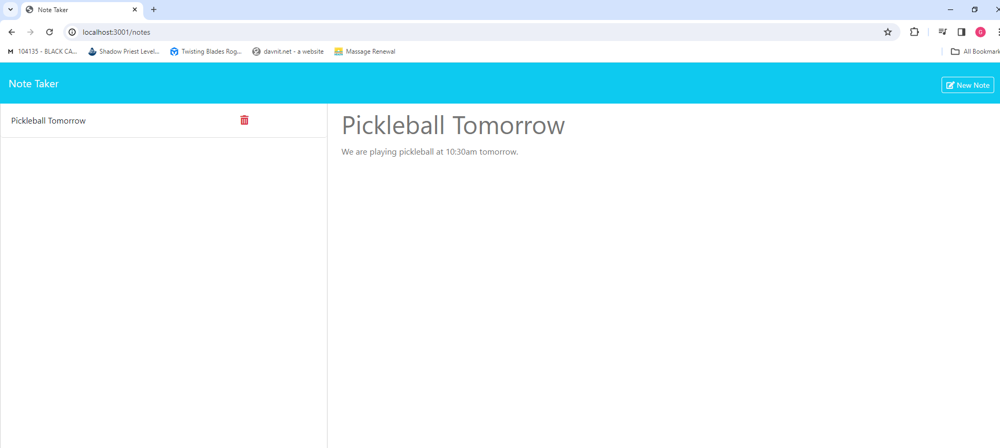

# Note Taker 

## Photo

## Table of Contents
  * [Description](#description)
  * [Technologies](#technologies-used)
  * [Future Development](#future-development)
  * [Demonstration](#demonstration)
  * [Installation](#installation)

## Description
This project is a simple note taking application.  The user can create a note with a title that will pin to the list on the left.  The user can read the notes at anytime, and eventually delete notes.  

## Future Development
* Allowing others to interact with the notes.
* Create time stamps for the notes.

## Collaboration
Feel free to use this as you please.  

## Demonstration

## Installation
* For installation onto local machine, clone provided repository.
* Use `npm install` to install dependencies.
* Use `npm start` to initiate the server in your terminal.
* Visit `http://localhost:3000/` in your browser. Default provided port is 3000.

## Contact
[Github](https://github.com/Spaghedward)